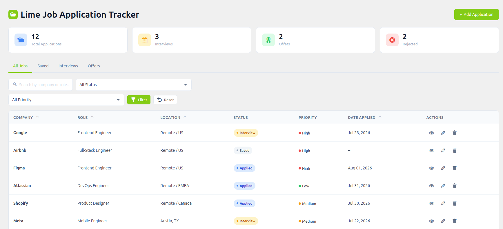
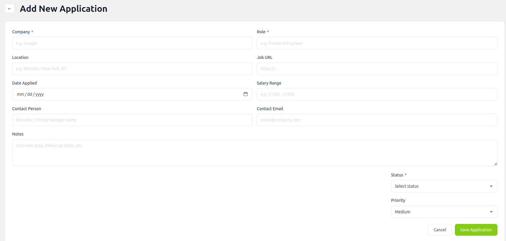
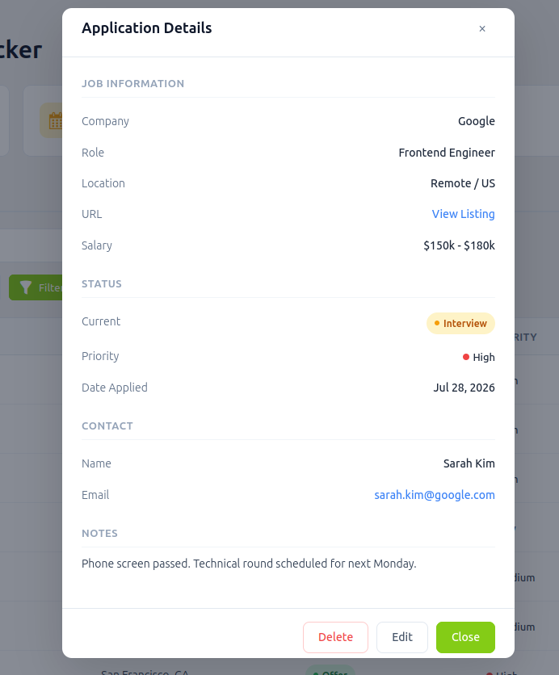

# Lime Job Application Tracker

> Track and manage your job applications from the WordPress admin dashboard — status, priority, contacts, notes, salary, and more, in one clean, full-width interface.

## Description

**Lime Job Application Tracker** is a lightweight yet powerful WordPress plugin that turns your admin dashboard into a personal job-search command center. Log every application you send, follow up on interviews, track offers and rejections, and filter your pipeline in real time — all without leaving WordPress.

Built with native WordPress APIs (custom table, admin menus, AJAX), no third-party dependencies, and a modern Tailwind-inspired UI.

## Features

- **Dashboard with live stats** — total applications, interviews, offers, and rejections at a glance.
- **Full application tracker** — company, role, location, job URL, status, priority, dates, salary, contact info, and notes.
- **Real-time filtering** — search by company/role/location and filter by status and priority with a dedicated Filter button.
- **AJAX pagination** — browse your pipeline without full page reloads.
- **Quick actions** — view details in a modal, edit inline, and delete with confirmation.
- **Status pipeline** — Saved, Applied, Interview, Offer, Rejected, Withdrawn.
- **Priority flags** — High / Medium / Low.
- **Full-width responsive layout** — works great on any screen size.
- **Secure by default** — nonce-verified AJAX, capability checks, prepared SQL statements, and sanitized inputs.

## Screenshots

### 1. Dashboard

The command center: KPI stat cards, a searchable/filterable table, inline actions, and AJAX pagination.

### 2. Add / Edit Application

A clean two-column form for logging a new application or editing an existing one.

### 3. Application Details

The modal detail view showing the full record for any application.

## Requirements

- WordPress 7.0 or higher
- PHP 8.0 or higher
- MySQL 8.0 (or MariaDB compatible)

## Installation

1. Upload the `lime-job-application-tracker` folder to `/wp-content/plugins/`, or install via **Plugins → Add New**.
2. Activate the plugin through the **Plugins** screen.
3. A **Job Tracker** menu item appears in the admin sidebar — start adding applications.

The plugin creates its own table (`wp_ljat_applications`) on activation; no configuration required.

## Frequently Asked Questions

**Do I need a developer to set this up?**
No. It's a standard plugin — activate and go.

**Is my data safe?**
Yes. All AJAX requests are nonce-verified, all inputs are sanitized, and every query uses prepared statements.

## Changelog

### 1.0.0
- Initial release.

## Credits

- **Author:** Your Name
- **Author URI:** [https://obydullah.com](https://obydullah.com)
- **Plugin URI:** [Lime Job Tracker Project](https://obydullah.com/project/lime-job-tracker-wordpress-plugin/)

## License

GPL v2 or later — see [LICENSE](https://www.gnu.org/licenses/gpl-2.0.html).
